# Cloud Deploy Platform

Proyecto de portafolio orientado a **Cloud / DevOps / Infrastructure**, en el que desarrollo una aplicación con **Node.js + Express**, la contenedorizo con **Docker**, la publico detrás de **Nginx** como *reverse proxy* y automatizo su despliegue en **AWS** usando **Terraform** y **user_data**.

## Resumen rápido

Este proyecto demuestra que soy capaz de:

- desarrollar una API básica con **Node.js + Express**
- contenedizar una aplicación con **Docker**
- usar **Nginx** como *reverse proxy*
- desplegar una aplicación en **AWS EC2**
- automatizar la infraestructura con **Terraform**
- automatizar el arranque y despliegue de la instancia con **user_data**
- documentar y validar el proceso con evidencias reales

En otras palabras, no es solo una app sencilla: es un flujo completo de **desarrollo + despliegue + automatización cloud**.

---

## Stack tecnológico

- **Node.js**
- **Express**
- **Docker**
- **Docker Compose**
- **Nginx**
- **AWS EC2**
- **AWS IAM**
- **AWS Systems Manager (Session Manager)**
- **Terraform**
- **Git / GitHub**

---

## Qué problema resuelve este proyecto

El objetivo principal de este proyecto ha sido construir una base práctica para un perfil **Cloud Engineer / DevOps Junior**.

En vez de quedarme en una app local, he trabajado un flujo más completo:

```text
desarrollo local
→ contenedorización
→ reverse proxy
→ despliegue manual en EC2
→ infraestructura como código
→ automatización del bootstrap de la instancia
→ despliegue automático en AWS
```

---

## Arquitectura

### Arquitectura lógica

```text
Usuario / navegador
        ↓
      Nginx
(reverse proxy, puerto 80)
        ↓
  App Node.js + Express
       (puerto 3000)
```

### Arquitectura en contenedores

```text
docker-compose
 ├── cloud-nginx
 └── cloud-app
```

### Arquitectura en AWS

```text
Internet
   ↓
EC2 con IP pública
   ↓
Nginx en contenedor
   ↓
App Node.js en contenedor
```

---

## Funcionalidad de la aplicación

La aplicación es una API sencilla desarrollada con Express y utilizada como base para practicar despliegue y automatización.

### Endpoints principales

- `/` → respuesta básica
- `/health` → health check
- `/ready` → readiness check
- `/tasks` → recurso de ejemplo

El endpoint principal para validar el despliegue es:

```bash
curl http://localhost/health
```

o, desde fuera de la instancia:

```bash
curl http://IP_PUBLICA/health
```

---

## Qué automatiza Terraform

Terraform crea los recursos principales en AWS:

- **EC2**
- **Security Group**
- **IAM Role**
- **IAM Instance Profile**
- **Policies para SSM y CloudWatch**

Además, la EC2 usa un script de **`user_data.sh`** para automatizar el arranque.

---

## Qué automatiza `user_data`

El script `user_data.sh` deja la instancia preparada automáticamente:

- instala **Docker**
- instala **Git**
- instala **Docker Compose**
- instala **Buildx**
- clona el repositorio desde GitHub
- ejecuta `docker compose up -d --build`
- deja la aplicación levantada en la nueva instancia

Esto fue la parte más importante del proyecto, porque me permitió pasar de:

```text
infraestructura automática + configuración manual
```

a:

```text
infraestructura automática + bootstrap automático + despliegue automático
```

---

## Estructura del proyecto

```text
cloud-deploy-platform/
├── README.md
├── app/
│   ├── Dockerfile
│   ├── package.json
│   ├── package-lock.json
│   └── src/
│       └── server.js
├── docker-compose.yml
├── nginx/
│   └── cloud-deploy-platform.conf
├── infra/
│   └── terraform/
│       ├── main.tf
│       ├── outputs.tf
│       ├── providers.tf
│       ├── terraform.tfvars
│       ├── user_data.sh
│       └── variables.tf
└── docs/
    └── evidence/
```

---

## Flujo de trabajo realizado

### 1. Desarrollo local
- creación de la app con Node.js + Express
- definición de endpoints
- pruebas locales con `curl`

### 2. Reverse proxy con Nginx
- configuración de Nginx para publicar la app en el puerto 80
- reenvío del tráfico hacia la aplicación en el puerto 3000

### 3. Contenedorización
- creación del `Dockerfile`
- uso de `docker-compose.yml`
- validación de `cloud-app` y `cloud-nginx`

### 4. Despliegue manual en AWS
- creación de una primera EC2
- acceso por Session Manager
- instalación de Docker, Git y Compose
- despliegue manual con Docker

### 5. Infraestructura como código con Terraform
- creación de recursos AWS con Terraform
- validación del estado y outputs

### 6. Automatización con `user_data`
- bootstrap de la nueva instancia
- instalación automática de herramientas
- clonación automática del repositorio
- despliegue automático de la aplicación

---

## Evidencias del proyecto

A continuación dejo algunas evidencias relevantes del proceso y del resultado final.

---

### App funcionando en local

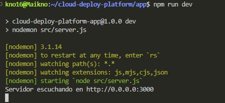

### Configuración del reverse proxy con Nginx

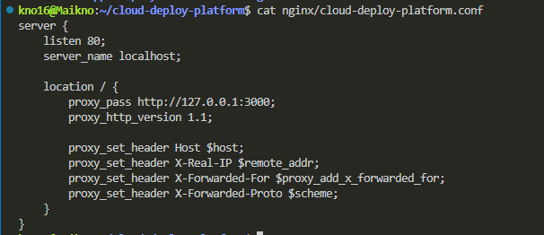

### Construcción y despliegue con Docker Compose en local

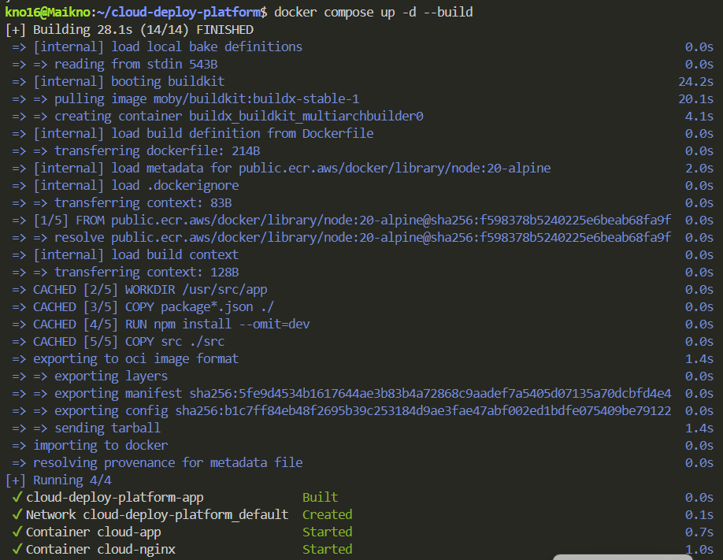

### Contenedores en ejecución en local

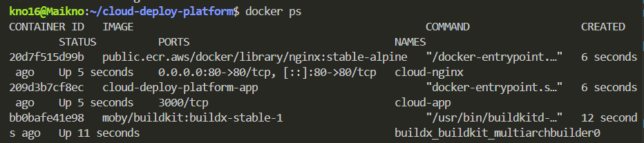

---

### Acceso a EC2 por Session Manager

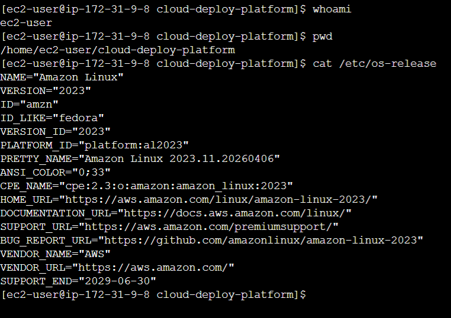

### EC2 en estado running

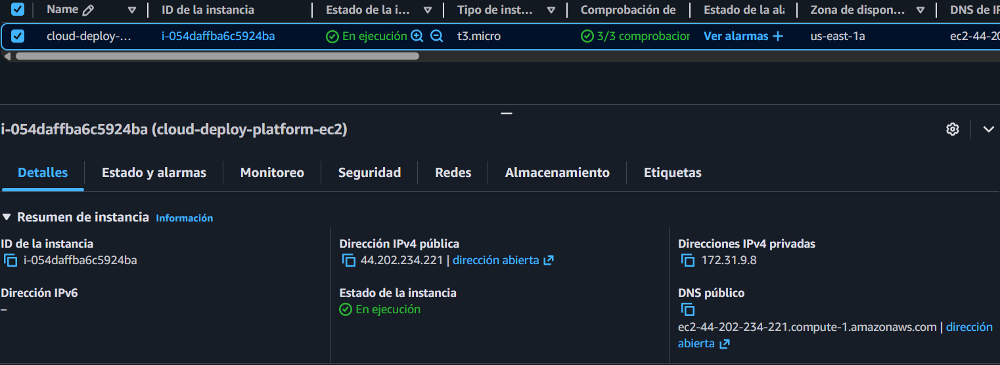

### Security Group con HTTP abierto

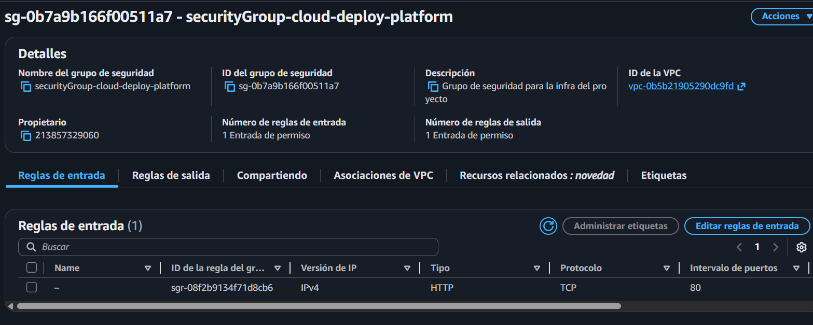

### IAM Role asociado a la instancia

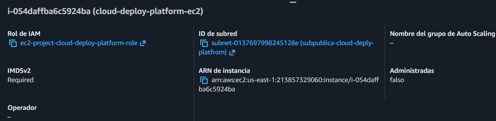

---

### Terraform plan

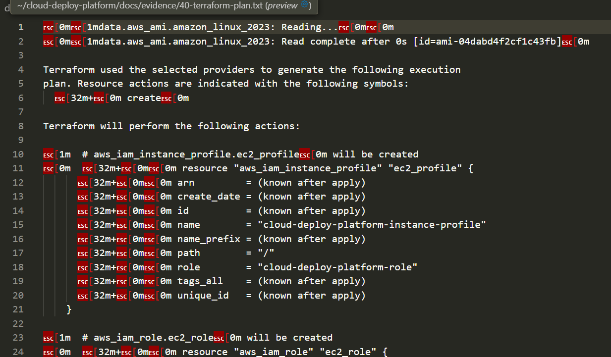

### Terraform apply

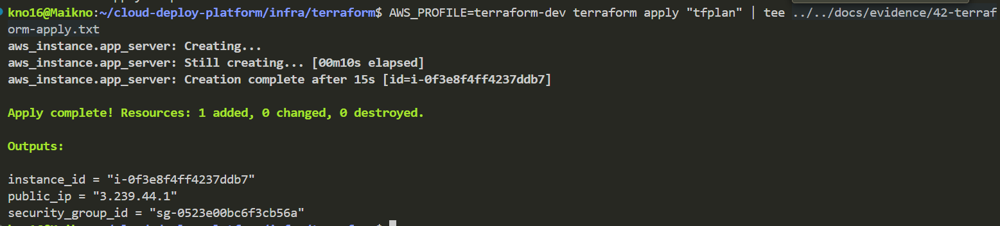

### Terraform output

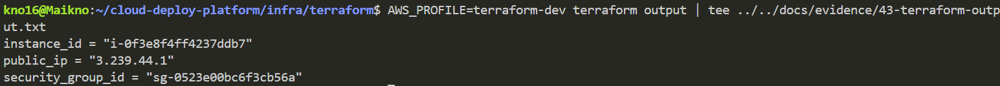

### Recursos gestionados en state

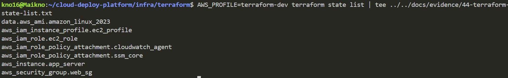

---

### Nueva EC2 creada por Terraform en running

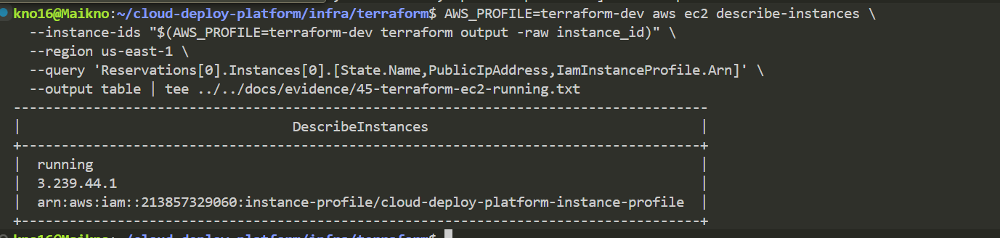

### Instancia visible en Systems Manager

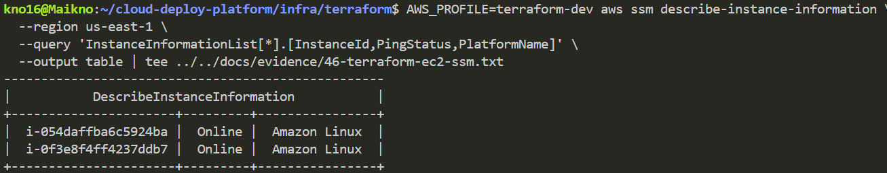

### Acceso por Session Manager a la instancia creada con Terraform

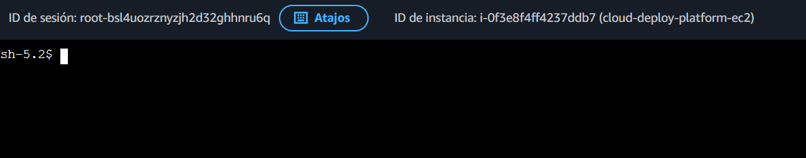

---

### Docker y Git instalados en la EC2 automatizada

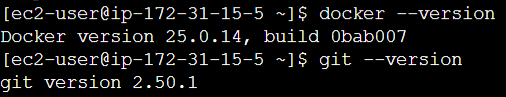

### Servicio Docker activo

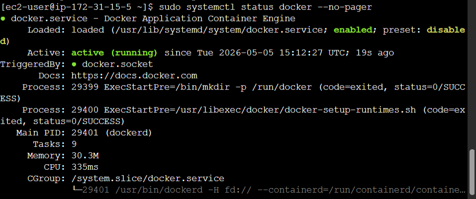

### Health check local tras `user_data`

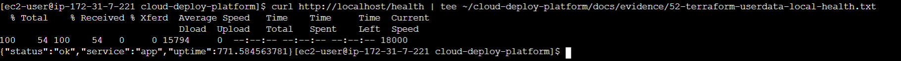

### Health check público por IP

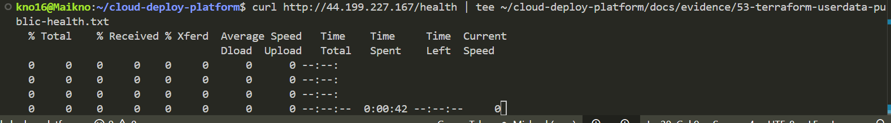

### Estructura del proyecto clonada automáticamente

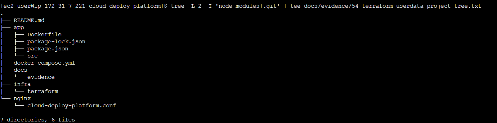

### Contenedores levantados automáticamente

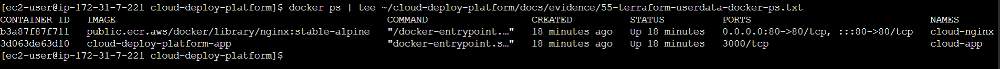

### Ejecución de cloud-init / user_data

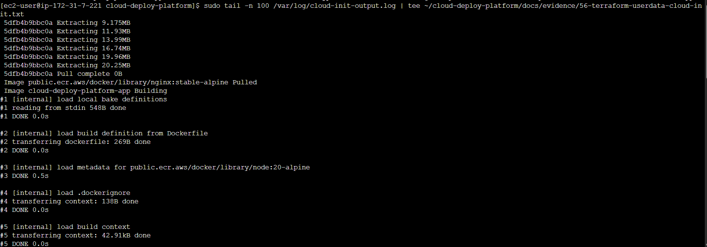

---

## Cómo ejecutar el proyecto en local

### Requisitos
- Docker
- Docker Compose

### Pasos

```bash
docker compose up -d --build
docker ps
curl http://localhost/health
```

---

## Cómo desplegar la infraestructura con Terraform

### Requisitos
- Terraform
- AWS CLI
- perfil AWS configurado correctamente

### Comandos básicos

```bash
cd infra/terraform
terraform init
terraform validate
terraform plan
terraform apply
```

---

## Resultados obtenidos

Con este proyecto he conseguido:

- desplegar una aplicación Node.js detrás de Nginx
- contenedizar la solución con Docker
- ejecutarla localmente con Docker Compose
- desplegarla manualmente en AWS EC2
- crear infraestructura con Terraform
- automatizar el bootstrap de la instancia con `user_data`
- conseguir una EC2 que instala dependencias, clona el repo y levanta la aplicación automáticamente

En mi opinión, el valor principal del proyecto no está en la complejidad de la aplicación, sino en haber trabajado el ciclo completo de despliegue y automatización cloud.

---

## Problemas encontrados y aprendizaje

Durante el desarrollo aparecieron problemas reales que me ayudaron a aprender bastante:

- conflictos con imágenes y pulls de contenedores
- diferencias entre `ssm-user` y `ec2-user`
- problemas con permisos de Docker
- errores de Buildx y Docker Compose en EC2
- problemas de credenciales AWS con Terraform
- diferencias entre regiones y subnets en AWS
- fallos en `user_data` por conflictos de paquetes en Amazon Linux

Resolver estos problemas me ayudó a entender mejor tanto el despliegue en cloud como la parte de troubleshooting, que considero una habilidad importante en este tipo de perfil.

---

## Posibles mejoras futuras

Como evolución del proyecto, me gustaría añadir:

- **GitHub Actions** para CI/CD
- **CloudWatch** para logs y métricas
- **ALB + Auto Scaling Group**
- una **VPC propia**
- separación por entornos (`dev`, `prod`)
- Terraform con `remote state`

---

## Conclusión

Este proyecto me ha servido para practicar un flujo bastante completo y realista:

```text
desarrollo local
→ contenedorización
→ despliegue manual
→ infraestructura como código
→ automatización del bootstrap
→ despliegue automático
```

Mi intención con este trabajo ha sido construir una base sólida y práctica para enseñar en procesos de selección relacionados con **Cloud**, **DevOps** o **infraestructura**.

---

## Autor

**Michael Cano**  
Proyecto de portafolio orientado a perfil **Cloud / DevOps / Infrastructure**
